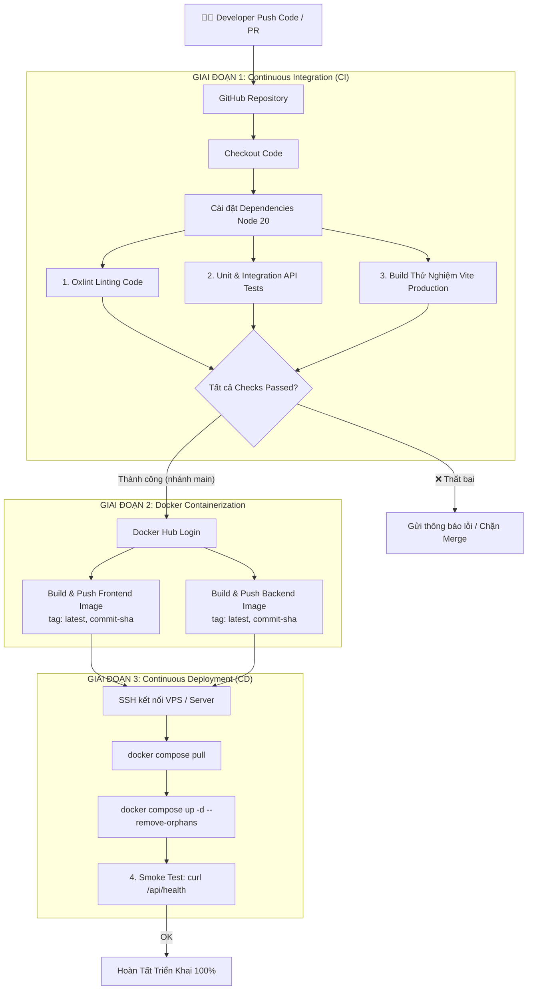

# KẾ HOẠCH & HƯỚNG PHÁT TRIỂN CI/CD CHO DỰ ÁN WEB BÁN Ô TÔ (AUTOPREMIUM)

> **Môn học**: DevOps / Kiến trúc & Triển khai Phần mềm  
> **Dự án**: Hệ thống Showroom & Quản lý Bán Ô tô Trực Tuyến AutoPremium  
> **Mã nguồn**: [chikien-finn/dev_ops_web_oto](https://github.com/chikien-finn/dev_ops_web_oto.git)

---

## 1. TỔNG QUAN KIẾN TRÚC HỆ THỐNG (SYSTEM ARCHITECTURE)

Hệ thống được thiết kế theo mô hình **Multi-Tier Containerized Web Application**, tách biệt hoàn toàn giữa Frontend, Backend và Tầng lưu trữ dữ liệu:

```
[ Khách hàng / Quản trị viên ]
             │
             ▼ (Cổng 8080)
   ┌──────────────────────────────────────────────┐
   │             Nginx Reverse Proxy              │
   │  - Phục vụ Static Files (React 19 SPA)       │
   │  - Xử lý Single Page Routing (try_files)     │
   │  - Gzip & Cache tĩnh                         │
   │  - Chuyển tiếp /api/* -> Backend:5000       │
   └──────────────────────┬───────────────────────┘
                          │ (Docker Network Nội bộ)
                          ▼
   ┌──────────────────────────────────────────────┐
   │             Node.js Express API              │
   │  - RESTful API (/api/cars, /api/auth, ...)   │
   │  - Xử lý nghiệp vụ lái thử (Bookings)        │
   │  - Quản lý người dùng & Phân quyền Admin     │
   │  - Health Check Endpoint (/api/health)       │
   └──────────────────────┬───────────────────────┘
                          │
                          ▼ (Mounted Volume)
   ┌──────────────────────────────────────────────┐
   │        Persistent Volume Storage             │
   │  - Lưu trữ dữ liệu lâu dài (cars, users...) │
   │  - Dễ dàng nâng cấp MongoDB/PostgreSQL       │
   └──────────────────────────────────────────────┘
```

---

## 2. THIẾT KẾ QUY TRÌNH CI/CD (PIPELINE ARCHITECTURE)

Hệ thống CI/CD được xây dựng bằng **GitHub Actions**, vận hành theo nguyên tắc **Quality Gate**: chỉ khi toàn bộ bài kiểm tra và mã nguồn đạt chuẩn thì mới tiến hành đóng gói Docker Image và Triển khai.



---

## 3. CHI TIẾT CÁC GIAI ĐOẠN TRONG PIPELINE

### Giai đoạn 1: Quality Gate (Kiểm tra chất lượng mã nguồn)
- **Công cụ**:
  - `oxlint`: Quét lỗi cú pháp, quy tắc React Compiler và clean-code siêu tốc (30ms).
  - `node:test`: Bộ kiểm thử tích hợp chuẩn của Node.js (7 test suites cho Auth, Cars, Bookings, Health).
  - `vite build`: Biên dịch mã nguồn React sang HTML/CSS/JS tĩnh để đảm bảo không có lỗi runtime/import.
- **Mục tiêu**: Phát hiện sớm lỗi logic hoặc xung đột ngay khi tạo Pull Request, bảo vệ nhánh `main`.

### Giai đoạn 2: Docker Build & Registry Push
- **Công cụ**: Docker Buildx + GitHub Actions Cache (`type=gha`).
- **Đóng gói**:
  - `web_ban_oto_frontend`: Nginx Alpine phục vụ web + Reverse Proxy.
  - `web_ban_oto_backend`: Node.js 20 Alpine chạy Express API.
- **Chiến lược gắn thẻ (Tagging)**:
  - `:latest`: Phục vụ môi trường chạy chính.
  - `:${{ github.sha }}`: Lưu trữ dấu vết commit chính xác, giúp **Rollback** tức thì khi gặp sự cố mà không cần build lại.

### Giai đoạn 3: Triển khai tự động (Continuous Deployment)
- **Phương pháp 1 (SSH Scripting - Tiêu chuẩn)**: GitHub Actions SSH vào máy chủ Linux (VPS EC2 / Linode / DigitalOcean), kéo image mới và kích hoạt `docker compose up -d`.
- **Phương pháp 2 (Watchtower / Webhook - Tối giản)**: Chạy một container Watchtower trên máy chủ, tự động quét Docker Hub mỗi khi có image mới và reload container trong 30 giây.
- **Phương pháp 3 (PaaS Cloud - Không cần bảo trì server)**: Kết nối GitHub Repo với Render, Railway hoặc Fly.io để auto-deploy container.

### Giai đoạn 4: Giám sát & Smoke Testing
- Sau khi khởi động container trên máy chủ, pipeline tự động gửi request `GET /api/health`. Nếu trả về HTTP 200 `{ status: "ok" }`, quá trình deploy được xác nhận thành công.

---

## 4. CHIẾN LƯỢC PHÂN NHÁNH & QUẢN LÝ SECRETS

### 4.1. Chiến lược Git Branching
- **Nhánh `feature/*`**: Dùng để phát triển tính năng mới. Khi push code hoặc mở Pull Request vào `main`, pipeline CI sẽ chạy kiểm thử tự động nhưng **chưa build Docker image** để tiết kiệm tài nguyên.
- **Nhánh `main`**: Đại diện cho phiên bản ổn định (Production). Chỉ merge khi PR đã pass toàn bộ CI checks. Khi merge vào `main`, toàn bộ luồng Build & Deploy sẽ tự động kích hoạt.
- **Gắn Tag phiên bản (`v1.0.0`, `v1.1.0`)**: Đánh dấu các mốc phát hành chính của đồ án.

### 4.2. Cấu hình GitHub Secrets & Variables
Vào repository GitHub: **Settings -> Secrets and variables -> Actions** và thiết lập các biến sau:

| Tên Secret | Loại | Ý nghĩa / Giá trị mẫu |
| :--- | :--- | :--- |
| `DOCKER_USERNAME` | Secret | Tên tài khoản Docker Hub (ví dụ: `chikienfinn`) |
| `DOCKER_PASSWORD` | Secret | Access Token cá nhân tạo từ Docker Hub (Security -> New Token) |
| `SSH_HOST` | Secret | IP hoặc Domain máy chủ VPS triển khai |
| `SSH_USER` | Secret | Tên người dùng SSH (ví dụ: `ubuntu`, `root`) |
| `SSH_KEY` | Secret | Khóa riêng tư SSH (Private Key) để Actions đăng nhập không cần mật khẩu |

---

## 5. LỘ TRÌNH PHÁT TRIỂN CI/CD (DEV-OPS ROADMAP)

```
        GIAI ĐOẠN 1 (Đã hoàn thành)
┌──────────────────────────────────────────────┐
│  - Thiết kế REST API Backend & Storage      │
│  - Container hóa Docker & Docker Compose     │
│  - Viết Unit / Integration Test Suites       │
│  - Tạo Workflow CI/CD cơ sở trên GitHub     │
└──────────────────────┬───────────────────────┘
                       ▼
        GIAI ĐOẠN 2 (Hiện thực hóa CD)
┌──────────────────────────────────────────────┐
│  - Triển khai máy chủ VPS (Oracle / AWS Free) │
│  - Cấu hình Domain & Nginx SSL (Let's Encrypt)│
│  - Kích hoạt Auto Deployment qua SSH/Actions │
└──────────────────────┬───────────────────────┘
                       ▼
        GIAI ĐOẠN 3 (Bảo mật & E2E Testing)
┌──────────────────────────────────────────────┐
│  - Quét mã nguồn tĩnh SonarCloud             │
│  - Quét lỗ hổng Image bằng Trivy Scanner     │
│  - Viết kiểm thử tự động giao diện Playwright│
└──────────────────────┬───────────────────────┘
                       ▼
        GIAI ĐOẠN 4 (Observability & Monitoring)
┌──────────────────────────────────────────────┐
│  - Giám sát CPU/RAM: Prometheus & Grafana   │
│  - Quản lý Log tập trung: Loki / Promtail    │
│  - Báo cáo trạng thái Deploy qua Telegram Bot │
└──────────────────────────────────────────────┘
```

### Các bước nâng cấp chi tiết theo từng giai đoạn:
1. **Giai đoạn 2 (Deploy thực tế)**:
   - Thuê máy chủ VPS miễn phí (Oracle Cloud Always Free hoặc AWS Free Tier EC2).
   - Cài đặt Docker & Docker Compose trên VPS.
   - Thêm SSH Secrets vào GitHub Repo để quy trình CD chạy thông suốt.
2. **Giai đoạn 3 (Nâng cao chất lượng & An toàn thông tin)**:
   - Thêm job `trivy-scan` vào file `.github/workflows/deploy.yml` để ngăn chặn các image có chứa CVE nguy hiểm.
   - Viết kịch bản E2E test bằng Playwright để kiểm tra hành vi đặt lịch lái thử từ phía người dùng thực tế.
3. **Giai đoạn 4 (Vận hành chuẩn Production)**:
   - Thêm Webhook gửi tin nhắn báo động về nhóm Telegram mỗi khi có phiên bản mới được deploy hoặc build thất bại.
   - Thêm Prometheus Exporter để theo dõi số lượng request và độ trễ phản hồi của API.

---

## 6. HƯỚNG DẪN THỰC THI CHO NHÓM PHÁT TRIỂN

### 6.1. Chạy môi trường phát triển (Local Development)
Chỉ với 1 câu lệnh duy nhất, hệ thống sẽ chạy song song cả React Frontend (port 5173) và Express Backend (port 5000):
```bash
npm run dev:all
```
*(Nếu muốn chạy riêng: `npm run dev` cho Web và `npm run dev:server` cho Backend)*

### 6.2. Kiểm thử chất lượng trước khi commit
```bash
# Chạy Unit & API Integration Tests
npm test

# Quét lỗi cú pháp
npm run lint

# Thử nghiệm build bản phân phối
npm run build
```

### 6.3. Khởi chạy toàn bộ hệ thống bằng Docker Compose (Mô phỏng Production)
```bash
# Build lại và khởi chạy containers ngầm
docker compose up -d --build

# Kiểm tra log thời gian thực
docker compose logs -f

# Tắt hệ thống
docker compose down
```
- Truy cập Giao diện Showroom: `http://localhost:8080`
- Kiểm tra Healthcheck Backend: `http://localhost:5000/api/health` hoặc qua Nginx `http://localhost:8080/api/health`
